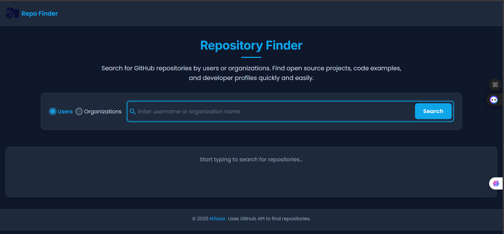

# <h1> Repo Finder - GitHub Repository Search</h1>


A simple web application built with vanilla JavaScript, HTML, and CSS that allows users to search for GitHub users or organizations and view their profile information along with a list of their most recently updated public repositories.

---

## ✨ Features

*   **Search by User:** Find GitHub users by their username.
*   **Search by Organization:** Find GitHub organizations by their name.
*   **Profile Information:** Displays the user/organization's avatar, name, bio, and a link to their GitHub profile.
*   **Repository Listing:** Shows the top public repositories (sorted by last updated, up to 10).
*   **Repository Details:** For each repository, it displays:
    *   Name (linked to the repository)
    *   Description
    *   Star count (⭐)
    *   Fork count (🍴)
    *   Watcher count (👀)
    *   Primary language
*   **Loading Indicator:** Shows a visual cue while fetching data from the API.
*   **Clear Feedback:** Provides informative messages for:
    *   Not found errors (user/org doesn't exist).
    *   Type mismatch errors (searching for a user but finding an org, or vice versa).
    *   Cases where a user/org exists but has no public repositories.
    *   Other API or network errors.
*   **Responsive Design:** Adapts to different screen sizes (basic responsiveness assumed from CSS).
*   **Accessibility:** Basic keyboard navigation support for search type selection.
*   **Security:** Uses HTML escaping (`escapeHtml`) to prevent XSS attacks from API data.

---

## 🚀 Live Demo

[**Live Demo Link**](https://rep0finder.netlify.app/) 

---

## 📸 Screenshot / PNG



---

## 🔧 Technologies Used

*   **HTML5:** For structuring the web page.
*   **CSS3:** For styling the application.
*   **JavaScript (ES6+ Modules):** For application logic, DOM manipulation, and API interaction.
*   **GitHub API v3 (REST):** To fetch user, organization, and repository data.
*   **No Frameworks/Libraries:** Built purely with vanilla web technologies.

---

## 🛠️ Getting Started Locally

To run this project on your local machine:

4.  **Clone the repository:**
    ```bash
    git clone https://github.com/n3ssar/Repo-Finder.git
 

5.  **Navigate to the project directory:**
    ```bash
    cd Repo-Finder
    ```

6.  **Open the `index.html` file:**
    *   You can simply double-click the `index.html` file to open it in your default web browser.
    *   Alternatively, use a simple local server (like the "Live Server" extension in VS Code) to serve the files. This is often a better approach for development.

---

## 💻 Usage

7.  Open the application (either the live demo or your local copy).
8.  Enter a GitHub username or organization name into the search bar.
9.  Select the correct search type ("Users" or "Organizations") using the radio buttons.
10.  Press Enter or click the "Search" button.
11.  View the fetched profile information and repository list below the search bar.

---

## 📁 Project Structure

```
/
├── index.html          # Main HTML file (the user interface)
├── assets/
│   ├── styles/
│   │   └── styles.css  # All CSS styles for the application
│   ├── scripts/
│   │   ├── main.js     # Main JS entry point, sets up event listeners
│   │   ├── utils.js    # Utility functions (DOM helpers, security, etc.)
│   │   ├── fetchDate.js # Functions for interacting with the GitHub API
│   │   ├── displayResults.js # Function to render API data to the DOM
│   │   └── handleSearch.js # Core logic for handling the search form submission
│   └── images/         # Contains logo, icons, etc.
└── README.md           # This file explaining the project
```

---

## 🤝 Contributing

Contributions are welcome! If you find a bug or have a suggestion for improvement, please feel free to:

12.  Fork the repository.
13.  Create a new branch (`git checkout -b feature/YourAmazingFeature`).
14.  Make your changes.
15.  Commit your changes (`git commit -m 'Add some AmazingFeature'`).
16.  Push to the branch (`git push origin feature/YourAmazingFeature`).
17.  Open a Pull Request.

Please ensure your code follows the existing style and includes clear commit messages.

---

## 📄 License

This project is licensed under the MIT License. See the [LICENSE](https://opensource.org/licenses/MIT) file (link to standard MIT license text) for details.

---

##  Acknowledgements

*   Data provided by the [**GitHub API**](https://docs.github.com/en/rest).
*   Icons used (if any specific source like FontAwesome, etc. was used).
